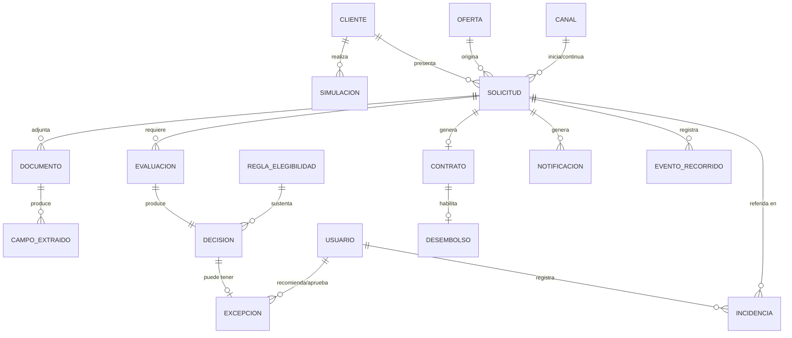
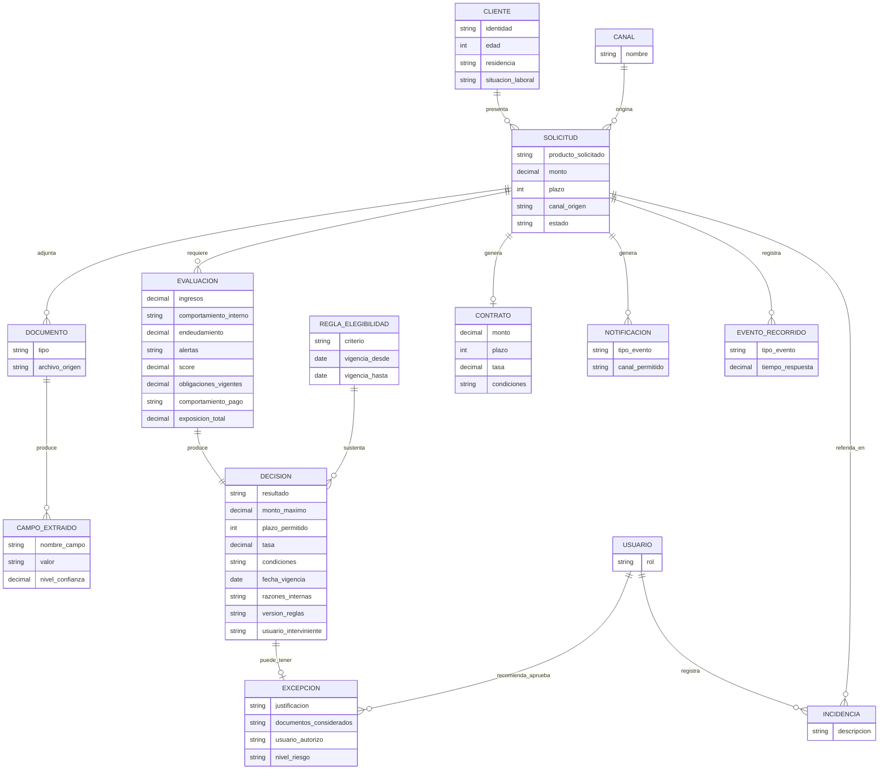
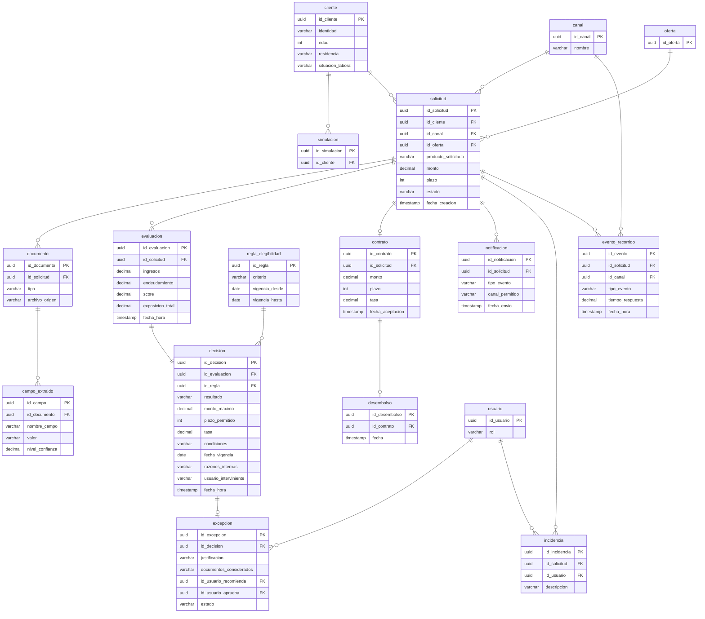

# 06 — Modelo de Datos
## Proyecto: Crédito Ágil 360

> Las entidades se extraen de la tabla "Evidencias iniciales" y de menciones explícitas en las entrevistas. Los **atributos de negocio** citados provienen literalmente del texto (p. ej. Riesgos P2, P4, P5, P9). Los **atributos técnicos estándar** (identificadores, fechas de auditoría, tipos de dato físicos) no fueron dictados por las entrevistas y se marcan como **[SUPUESTO TÉCNICO — a validar]**; no constituyen reglas de negocio, sino convenciones habituales de modelado necesarias para que el modelo sea implementable.

---

## 1. Modelo Conceptual

### Entidades (solo objetos de negocio mencionados)
Cliente, Solicitud, Oferta, Simulación, Documento, CampoExtraído, Evaluación, Decisión, ReglaDeElegibilidad, Excepción, Contrato, Desembolso, Notificación, Canal, Incidencia, EventoDeRecorrido, Usuario (Analista/Supervisor/Asesor/Agente).

*Fuente: tabla "Evidencias iniciales" (Actores, Objetos de negocio); Riesgos P3, P5, P9; Canales P9, P10.*

### Relaciones (solo las que se infieren directamente del texto)
- Un **Cliente** realiza una o varias **Simulaciones** y **Solicitudes**. (Canales P2)
- Una **Oferta** puede originar una **Solicitud**. (Canales P2)
- Una **Solicitud** se inicia y continúa en uno o varios **Canales**. (Canales P1, P4)
- Una **Solicitud** tiene cero o varios **Documentos** adjuntos. (Canales P2; Riesgos P9)
- Un **Documento** produce cero o varios **CampoExtraído** (por IA). (Riesgos P9)
- Una **Solicitud** tiene una o varias **Evaluaciones**, y cada Evaluación produce una **Decisión**. (Riesgos P1, P4)
- Una **Decisión** se sustenta en una **ReglaDeElegibilidad** vigente (versión). (Riesgos P3, P5)
- Una **Decisión** puede tener asociada una **Excepción**, recomendada por un Analista y aprobada por un Supervisor. (Riesgos P7)
- Una **Solicitud** aprobada y aceptada genera un **Contrato**, que habilita un **Desembolso**. (Canales P2)
- Una **Solicitud** genera una o varias **Notificaciones**. (Canales P6)
- Una **Solicitud** genera uno o varios **EventoDeRecorrido**. (Canales P10)
- Un **Agente** registra cero o varias **Incidencias** sobre una **Solicitud**. (Canales P9)

### Diagrama ER — Conceptual (mermaid)

---

## 2. Modelo Lógico

> Se listan solo los atributos explícitamente mencionados en las entrevistas para cada entidad. Los atributos adicionales necesarios para que el modelo sea funcional se marcan como supuesto técnico.

- **Cliente**: identidad, edad, residencia, situación laboral *(Riesgos P2)* — id_cliente **[SUPUESTO TÉCNICO]**.
- **Solicitud**: producto solicitado, monto, plazo, canal de origen, estado *(Riesgos P2; Canales P5)* — id_solicitud, fecha_creación **[SUPUESTO TÉCNICO]**.
- **Oferta**: (mencionada como origen de la solicitud, sin atributos propios detallados) *(Canales P2)* — id_oferta **[SUPUESTO TÉCNICO]**.
- **Simulación**: (mencionada como paso previo a la solicitud, sin atributos detallados) *(Canales P2)* — id_simulación **[SUPUESTO TÉCNICO]**.
- **Documento**: tipo (boleta, constancia), archivo de origen *(Riesgos P9)* — id_documento **[SUPUESTO TÉCNICO]**.
- **CampoExtraído**: nombre del campo, valor, nivel_de_confianza, documento_origen *(Riesgos P9)* — id_campo **[SUPUESTO TÉCNICO]**.
- **Evaluación**: ingresos, comportamiento interno, endeudamiento, alertas, score, obligaciones vigentes, comportamiento de pago, exposición total *(Riesgos P1, P2)* — id_evaluación, fecha_hora **[SUPUESTO TÉCNICO]**.
- **Decisión**: resultado (aprobado/rechazado/observado/revisión manual), monto máximo, plazo permitido, tasa, condiciones, fecha de vigencia, razones internas, versión_de_reglas, score, hora, datos_usados, fuente_de_datos, usuario_interviniente *(Riesgos P4, P5)* — id_decisión **[SUPUESTO TÉCNICO]**.
- **ReglaDeElegibilidad**: criterio (campaña/apetito de riesgo/segmento/cartera/regulación), vigencia *(Riesgos P3)* — id_regla, versión **[SUPUESTO TÉCNICO]**.
- **Excepción**: justificación, documentos considerados, usuario que autorizó, nivel de riesgo *(Riesgos P7)* — id_excepción, estado **[SUPUESTO TÉCNICO]**.
- **Contrato**: monto, plazo, tasa, condiciones *(Canales P2)* — id_contrato, fecha_aceptación **[SUPUESTO TÉCNICO]**.
- **Desembolso**: (mencionado como resultado final del proceso, sin atributos propios detallados) *(Canales P2, P6)* — id_desembolso, fecha **[SUPUESTO TÉCNICO]**.
- **Notificación**: tipo de evento, canal permitido (app/correo/SMS) *(Canales P6)* — id_notificación, fecha_envío **[SUPUESTO TÉCNICO]**.
- **Canal**: nombre (app, web, agencia, contact center) *(Canales P1)* — id_canal **[SUPUESTO TÉCNICO]**.
- **Incidencia**: (registrada por el agente de contact center, sin atributos detallados) *(Canales P9)* — id_incidencia, descripción **[SUPUESTO TÉCNICO]**.
- **EventoDeRecorrido**: tipo (ingreso, abandono, error, documento rechazado, reintento), tiempo de respuesta *(Canales P10)* — id_evento, fecha_hora **[SUPUESTO TÉCNICO]**.
- **Usuario**: rol (analista, supervisor, asesor, agente) *(Riesgos P7; Canales P4, P9)* — id_usuario **[SUPUESTO TÉCNICO]**.

### Diagrama ER — Lógico (mermaid)

---

## 3. Modelo Físico

> Nombres de tabla, tipos de dato y llaves son **[SUPUESTO TÉCNICO — a validar con el equipo de arquitectura de datos]**, ya que las entrevistas no especifican el motor de base de datos, tipos de dato ni longitudes. Solo la existencia de los campos de negocio está confirmada por las entrevistas (ver sección 2).

### Tablas propuestas (resumen)

| Tabla | PK | FK relevantes |
|---|---|---|
| cliente | id_cliente | — |
| canal | id_canal | — |
| solicitud | id_solicitud | id_cliente, id_canal, id_oferta |
| oferta | id_oferta | — |
| simulacion | id_simulacion | id_cliente |
| documento | id_documento | id_solicitud |
| campo_extraido | id_campo | id_documento |
| evaluacion | id_evaluacion | id_solicitud |
| decision | id_decision | id_evaluacion, id_regla |
| regla_elegibilidad | id_regla | — |
| excepcion | id_excepcion | id_decision, id_usuario_recomienda, id_usuario_aprueba |
| contrato | id_contrato | id_solicitud |
| desembolso | id_desembolso | id_contrato |
| notificacion | id_notificacion | id_solicitud |
| incidencia | id_incidencia | id_solicitud, id_usuario |
| evento_recorrido | id_evento | id_solicitud, id_canal |
| usuario | id_usuario | — |

### Diagrama ER — Físico (mermaid)

## Datos maestros vs. transaccionales (según lo declarado)
- **Datos maestros (relativamente estables):** Cliente, Canal, Usuario, ReglaDeElegibilidad (con versión), Oferta.
- **Datos transaccionales:** Solicitud, Simulación, Documento, CampoExtraído, Evaluación, Decisión, Excepción, Contrato, Desembolso, Notificación, Incidencia, EventoDeRecorrido.

*Base: distinción implícita en Riesgos P3 (reglas con vigencia y cambios frecuentes) y Riesgos P5 (histórico inmutable de decisiones). La clasificación formal maestro/transaccional no fue enunciada explícitamente por los entrevistados; se marca como interpretación del equipo — ver `discrepancias.md`.*
