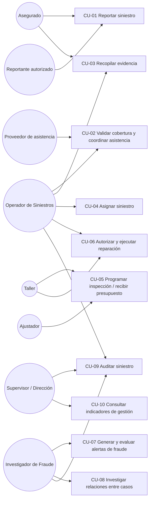

# Casos de Uso — Siniestro Fácil

> Los actores y pasos provienen de las entrevistas. Donde el flujo de excepción no fue descrito con precisión, se indica como pendiente.

## Actores del sistema
- **Asegurado** — titular de la póliza. *(Entrevista 1, P6; Entrevista 2, P1)*
- **Reportante autorizado** — tercero que reporta cuando el titular no puede. *(Entrevista 1, P6)*
- **Operador de Siniestros** — registra, valida y da seguimiento a los casos. *(Entrevista 2)*
- **Ajustador** — evalúa casos complejos derivados. *(Entrevista 1, P3; Entrevista 2, P5)*
- **Investigador de Fraude** — revisa señales y alertas. *(Entrevista 3)*
- **Taller** — presenta presupuestos y ejecuta reparaciones. *(Entrevista 2, P7)*
- **Proveedor de asistencia / grúa** — atiende solicitudes de asistencia. *(Entrevista 2, P1, P9)*
- **Supervisor / Gerencia** — supervisa el proceso y consulta indicadores. *(Entrevista 1, P4; Entrevista 2, P10)*
- **Sistema de asignación / motor de reglas** — asigna y prioriza casos. *(Entrevista 2, P5)*
- **Motor de IA (apoyo)** — clasifica, prioriza y sugiere señales. *(Entrevista 1, P8; Entrevista 3, P6)*

---

## CU-01 Reportar un siniestro
**Actor principal:** Asegurado o Reportante autorizado.
**Fuente:** Entrevista 1 (P3, P6), Entrevista 2 (P1, P2).

**Flujo principal:**
1. El reportante inicia el reporte desde la aplicación.
2. El sistema solicita número de póliza o documento, placa del vehículo, fecha y ubicación aproximada, tipo de evento y un medio de contacto.
3. El sistema confirma identidad del reportante, la póliza y el vehículo.
4. El sistema registra fecha, hora, ubicación, personas involucradas, descripción y daños aparentes.
5. El sistema guía al reportante paso a paso (qué hacer, cómo protegerse, qué evidencia recopilar).
6. El caso queda en estado "reportado".

**Flujos alternativos:**
- A1. El reportante no cuenta con toda la evidencia: el sistema permite continuar y deja el caso con evidencia pendiente. *(Entrevista 2, P2)*
- A2. El reportante es distinto al asegurado: el sistema registra que el reporte fue hecho por un tercero autorizado. *(Entrevista 1, P6)*

---

## CU-02 Validar cobertura y coordinar asistencia
**Actor principal:** Operador de Siniestros (con apoyo del sistema).
**Fuente:** Entrevista 2, P1.

**Flujo principal:**
1. El operador (o el sistema) verifica la cobertura y el deducible del caso.
2. El caso pasa a "validando cobertura".
3. Si corresponde asistencia, se coordina la solicitud (por ejemplo, grúa).
4. El caso pasa a "asistencia coordinada".

**Flujo alternativo:**
- A1. El proveedor de asistencia no responde: se reintenta, se escala o se reasigna, sin bloquear al asegurado. *(Entrevista 2, P9)*

---

## CU-03 Recopilar evidencia del siniestro
**Actor principal:** Asegurado, reportante autorizado u operador.
**Fuente:** Entrevista 2, P3; Entrevista 3, P3.

**Flujo principal:**
1. El actor adjunta evidencia (fotografías, documentos de identidad, licencia, tarjeta de propiedad, declaración del conductor, datos de terceros, denuncia cuando aplique).
2. El sistema vincula cada evidencia al siniestro, al momento de captura y, cuando sea posible, a ubicación y dispositivo.
3. El sistema conserva el contenido original, su hash y metadatos, generando versiones optimizadas sin sustituir el original.
4. El caso avanza de "evidencia pendiente" a "en evaluación" cuando la evidencia requerida está disponible.

---

## CU-04 Asignar el siniestro
**Actor principal:** Sistema de asignación (con supervisión del Operador).
**Fuente:** Entrevista 2, P5; Entrevista 1, P3.

**Flujo principal:**
1. El sistema evalúa ciudad, tipo de daño, severidad, cobertura, disponibilidad de proveedores y señales de riesgo.
2. Si el caso es simple, se asigna a un flujo digital.
3. Si el caso es complejo, se asigna a un Ajustador.
4. El caso queda con un responsable y un motivo de asignación registrados.

**Flujo alternativo:**
- A1. Reasignación: se registra el nuevo responsable, el historial previo y la razón del cambio. *(Entrevista 2, P5)*

---

## CU-05 Programar inspección y recibir presupuesto de taller
**Actor principal:** Ajustador / Operador y Taller.
**Fuente:** Entrevista 2, P4, P7, P8.

**Flujo principal:**
1. Se programa la inspección del vehículo; el caso pasa a "inspección programada".
2. El taller recibe la orden.
3. El taller presenta presupuesto y adjunta diagnóstico; el caso pasa a "presupuesto recibido".
4. El sistema registra la vigencia del presupuesto.

**Flujos alternativos:**
- A1. El presupuesto es observado: el caso pasa a "observado" y se registra la observación. *(Entrevista 2, P4)*
- A2. Durante la reparación surgen repuestos alternativos o ampliaciones: cada cambio se registra con quién lo aprobó. *(Entrevista 2, P7)*

---

## CU-06 Autorizar y ejecutar la reparación
**Actor principal:** Operador / Ajustador y Taller.
**Fuente:** Entrevista 2, P4, P7.

**Flujo principal:**
1. El presupuesto es aprobado y el caso pasa a "autorizado".
2. El taller inicia la reparación; el caso pasa a "en reparación".
3. Al finalizar, el caso pasa a "listo para entrega".
4. Se registra la indemnización correspondiente; el caso pasa a "indemnizado" y luego a "cerrado".

**Flujo alternativo:**
- A1. El caso es rechazado en cualquier punto de evaluación: el caso pasa a "rechazado", con la justificación registrada (evitando el "rechazo incorrecto de coberturas"). *(Entrevista 1, P7)*

---

## CU-07 Generar y evaluar alertas de fraude
**Actor principal:** Motor de IA / Reglas e Investigador de Fraude.
**Fuente:** Entrevista 3, P1, P2, P4, P5.

**Flujo principal:**
1. El motor de reglas o modelos evalúa señales de riesgo (repetición de participantes/vehículos/talleres, pólizas recientes al evento, ubicaciones incoherentes, fotos reutilizadas, montos atípicos, versiones contradictorias, patrones de contacto compartidos, antecedentes de reclamos).
2. Si corresponde, se genera una alerta con tipo, severidad, explicación, datos de origen, fecha y modelo o regla utilizado.
3. Según la política vigente (configurable y versionada), la alerta puede: (a) bloquear temporalmente un pago o derivar el caso, o (b) solo aumentar la prioridad de revisión.
4. El investigador revisa la alerta y la confirma, la descarta o solicita más información, dejando la justificación registrada.

**Regla de negocio explícita:** una inconsistencia por sí sola no constituye fraude confirmado ni produce rechazo automático. *(Entrevista 3, P1)*

---

## CU-08 Investigar relaciones entre casos
**Actor principal:** Investigador de Fraude.
**Fuente:** Entrevista 3, P8.

**Flujo principal:**
1. El investigador consulta un caso.
2. El sistema muestra otros siniestros relacionados por accidente, teléfono, cuenta bancaria, taller o persona.
3. El investigador analiza la relación sin que los expedientes se fusionen.

---

## CU-09 Auditar un siniestro
**Actor principal:** Operador, Supervisor o Investigador de Fraude (según nivel de acceso).
**Fuente:** Entrevista 2, P10; Entrevista 3, P7, P10.

**Flujo principal:**
1. El actor solicita la línea de tiempo del caso.
2. El sistema muestra quién registró información, qué cambió, qué evidencias se añadieron, qué cobertura se aplicó, qué proveedor actuó, qué presupuesto fue aprobado, qué comunicación recibió el cliente y qué pago se autorizó.
3. Para casos con alertas de fraude, el sistema permite reconstruir la versión de la regla o modelo y los datos de entrada usados, incluso si ya cambiaron.

**Regla de acceso:** la información ampliada de fraude solo es visible para investigadores autorizados; toda consulta o descarga sensible queda registrada. *(Entrevista 3, P7)*

---

## CU-10 Consultar indicadores de gestión
**Actor principal:** Dirección / Supervisor.
**Fuente:** Entrevista 1, P4.

**Flujo principal:**
1. El actor consulta el panel de indicadores.
2. El sistema muestra tiempo hasta primera asistencia, tiempo hasta decisión, porcentaje de casos resueltos sin llamadas adicionales, satisfacción del cliente, costo operativo por siniestro y pérdidas evitadas por fraude, en conjunto.

---

## Diagrama de casos de uso (mermaid)

