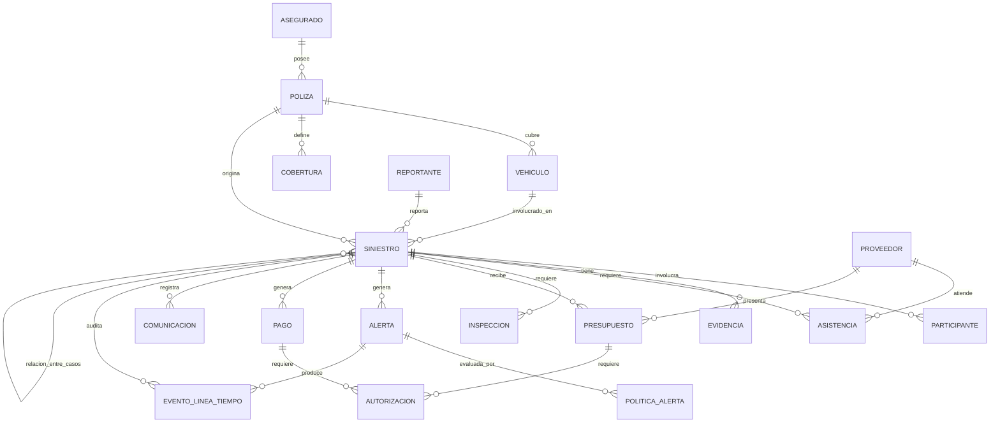

# Modelo Conceptual de Datos — Siniestro Fácil

> Nivel conceptual: entidades del negocio y sus relaciones, sin atributos ni tipos de dato. Las entidades provienen de la tabla "Evidencias iniciales" (objetos de negocio) y de las menciones explícitas de cada entrevistado.

## Entidades identificadas

| Entidad | Origen |
|---|---|
| Asegurado | Entrevista 2, P1 |
| Reportante | Entrevista 1, P6 (puede ser el asegurado u otra persona autorizada) |
| Póliza | Tabla de evidencias; Entrevista 2, P1, P2 |
| Vehículo | Tabla de evidencias; Entrevista 2, P1, P2 |
| Siniestro | Tabla de evidencias; todas las entrevistas |
| Participante | Tabla de evidencias; Entrevista 2, P1 ("personas involucradas") |
| Cobertura | Tabla de evidencias; Entrevista 2, P1 |
| Evidencia | Tabla de evidencias; Entrevista 2, P3; Entrevista 3, P3 |
| Asistencia | Tabla de evidencias; Entrevista 2, P1 |
| Inspección | Tabla de evidencias; Entrevista 2, P4, P8 |
| Presupuesto | Tabla de evidencias; Entrevista 2, P7 |
| Autorización | Tabla de evidencias; Entrevista 2, P6 |
| Alerta (de fraude) | Tabla de evidencias; Entrevista 3, P2, P4 |
| Pago | Tabla de evidencias; Entrevista 2, P10; Entrevista 3, P5 |
| Proveedor (taller / grúa u otro) | Entrevista 2, P7, P9 |
| Operador / Ajustador / Investigador / Supervisor | Entrevistas 2 y 3 (actores del proceso) |
| Comunicación | Entrevista 2, P10 ("qué comunicación recibió el cliente") |
| Relación entre casos | Entrevista 3, P8 |
| Política de alerta (versión) | Entrevista 3, P5, P10 |
| Línea de tiempo / evento de auditoría | Entrevista 2, P10; Entrevista 3, P10 |

## Relaciones principales

- Un **Asegurado** posee una o varias **Pólizas**. *(Entrevista 2, P1)*
- Una **Póliza** cubre uno o varios **Vehículos** y define una o varias **Coberturas**. *(Entrevista 2, P1)*
- Un **Siniestro** se reporta sobre una **Póliza** y un **Vehículo**, e involucra a uno o varios **Participantes**. *(Entrevista 2, P1)*
- Un **Siniestro** es iniciado por un **Reportante** (que puede ser el Asegurado u otra persona autorizada). *(Entrevista 1, P6)*
- Un **Siniestro** tiene asociada una o varias **Evidencias**. *(Entrevista 2, P3)*
- Un **Siniestro** puede requerir una o varias **Asistencias**. *(Entrevista 2, P1)*
- Un **Siniestro** puede requerir una o varias **Inspecciones**. *(Entrevista 2, P4, P8)*
- Un **Siniestro** puede recibir uno o varios **Presupuestos** de un **Proveedor** (taller). *(Entrevista 2, P7)*
- Un **Presupuesto** puede tener uno o varios cambios (observaciones, repuestos alternativos, ampliaciones), cada uno con una **Autorización**. *(Entrevista 2, P7)*
- Un **Siniestro** genera cero o varias **Alertas** de fraude. *(Entrevista 3, P4)*
- Una **Alerta** se evalúa según una **Política de alerta** vigente (versionada). *(Entrevista 3, P5, P10)*
- Un **Siniestro** puede relacionarse con otros **Siniestros** a través de una **Relación entre casos** (por accidente, teléfono, cuenta bancaria, taller o persona compartidos), sin fusionarse. *(Entrevista 3, P8)*
- Un **Siniestro** genera uno o varios **Pagos**, sujetos a **Autorización**. *(Entrevista 2, P10)*
- Un **Siniestro** registra una o varias **Comunicaciones** hacia el Asegurado. *(Entrevista 2, P10)*
- Todo cambio relevante sobre un **Siniestro** (o sus entidades relacionadas) genera un evento en la **Línea de tiempo**, asociado al usuario que lo realizó. *(Entrevista 2, P10)*
- Un **Proveedor** puede ser un taller o un proveedor de asistencia (por ejemplo, grúa), y participa en **Asistencias** o **Presupuestos**. *(Entrevista 2, P7, P9)*

## Diagrama entidad-relación conceptual (mermaid)

