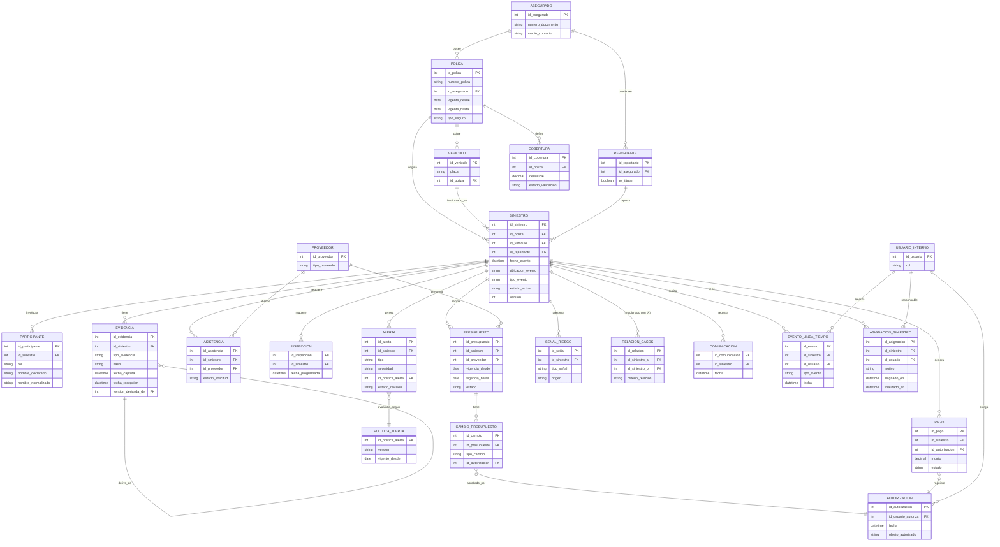

# Modelo Lógico de Datos — Siniestro Fácil

> Nota metodológica: los identificadores (`id_*`), llaves foráneas y las marcas de auditoría técnica (`creado_en`, `creado_por`) son elementos estructurales necesarios en cualquier modelo relacional; no constituyen un requerimiento de negocio adicional y se marcan como **[estructural]**. Todos los demás atributos citan la entrevista y pregunta de origen. Donde un atributo es necesario para sostener una relación pero no fue mencionado explícitamente (por ejemplo, un nombre de persona), se marca **[pendiente — ver discrepancias.md]**.

## ASEGURADO
| Atributo | Tipo | Origen |
|---|---|---|
| id_asegurado (PK) | identificador | [estructural] |
| numero_documento | texto | Entrevista 2, P2 |
| tipo_documento | texto | [pendiente] |
| medio_contacto | texto | Entrevista 2, P2 |
| nombre | texto | [pendiente] |

## REPORTANTE
| Atributo | Tipo | Origen |
|---|---|---|
| id_reportante (PK) | identificador | [estructural] |
| id_asegurado (FK, nulo si es tercero) | identificador | Entrevista 1, P6 |
| es_titular | booleano | Entrevista 1, P6 ("persona autorizada... si el titular no puede hacerlo") |
| medio_contacto | texto | Entrevista 2, P2 |
| relacion_asegurado | enumerado (familiar, dependiente, testigo, otro); nulo si es titular | [PROPUESTA DM-01 — `26_decisiones_modelado_sprint_0.md`] |

## POLIZA
| Atributo | Tipo | Origen |
|---|---|---|
| id_poliza (PK) | identificador | [estructural] |
| numero_poliza | texto | Entrevista 2, P2 |
| id_asegurado (FK) | identificador | Entrevista 2, P1 |
| vigente_desde / vigente_hasta | fecha | Entrevista 1, P5 ("pólizas vigentes") |
| tipo_seguro | texto | Contexto ficticio ("vehiculares, de salud y de hogar"), acotado a vehicular por alcance (Entrevista 1, P5) |

## VEHICULO
| Atributo | Tipo | Origen |
|---|---|---|
| id_vehiculo (PK) | identificador | [estructural] |
| placa | texto | Entrevista 2, P2 |
| id_poliza (FK) | identificador | Entrevista 2, P1 |

## COBERTURA
| Atributo | Tipo | Origen |
|---|---|---|
| id_cobertura (PK) | identificador | [estructural] |
| id_poliza (FK) | identificador | Entrevista 2, P1 |
| deducible | numérico | Entrevista 2, P1 |
| estado_validacion | texto | Entrevista 2, P1 ("validando cobertura") |

## SINIESTRO
| Atributo | Tipo | Origen |
|---|---|---|
| id_siniestro (PK) | identificador | [estructural] |
| id_poliza (FK) | identificador | Entrevista 2, P1 |
| id_vehiculo (FK) | identificador | Entrevista 2, P1 |
| id_reportante (FK) | identificador | Entrevista 1, P6 |
| fecha_evento | fecha/hora | Entrevista 2, P1 |
| ubicacion_evento | texto/geográfico | Entrevista 2, P1 |
| tipo_evento | texto | Entrevista 2, P2 |
| descripcion | texto | Entrevista 2, P1 |
| danos_aparentes | texto | Entrevista 2, P1 |
| estado_actual | enumerado (ver catálogo `ESTADO_SINIESTRO`) | Entrevista 2, P4 |
| canal_origen | texto | Entrevista 2, P6 (implica canal: teléfono, correo, app, corredor) |
| version | entero no negativo, inicial 0 | [PROPUESTA DM-02 — control de concurrencia optimista] |

> `siguientePaso` se calcula y no se persiste, según DM-03.

## ESTADO_SINIESTRO (catálogo)
| Valor | Origen |
|---|---|
| reportado | Entrevista 2, P4 |
| validando_cobertura | Entrevista 2, P4 |
| asistencia_coordinada | Entrevista 2, P4 |
| evidencia_pendiente | Entrevista 2, P4 |
| en_evaluacion | Entrevista 2, P4 |
| inspeccion_programada | Entrevista 2, P4 |
| presupuesto_recibido | Entrevista 2, P4 |
| autorizado | Entrevista 2, P4 |
| observado | Entrevista 2, P4 |
| rechazado | Entrevista 2, P4 |
| en_reparacion | Entrevista 2, P4 |
| listo_para_entrega | Entrevista 2, P4 |
| indemnizado | Entrevista 2, P4 |
| cerrado | Entrevista 2, P4 |

> Los subestados internos existen pero no se detallan en las entrevistas ("hay subestados internos que el cliente no necesita ver", Entrevista 2, P4); se listan como pendiente en `discrepancias.md`.

## PARTICIPANTE
| Atributo | Tipo | Origen |
|---|---|---|
| id_participante (PK) | identificador | [estructural] |
| id_siniestro (FK) | identificador | Entrevista 2, P1 |
| rol | texto (conductor, tercero, etc.) | Entrevista 2, P3 ("datos de terceros") |
| nombre_declarado | texto | Entrevista 3, P9 (valor declarado) |
| nombre_normalizado | texto | Entrevista 3, P9 (valor normalizado) |

## EVIDENCIA
| Atributo | Tipo | Origen |
|---|---|---|
| id_evidencia (PK) | identificador | [estructural] |
| id_siniestro (FK) | identificador | Entrevista 2, P3 |
| tipo_evidencia | texto (foto vehículo, foto daños, foto entorno, documento identidad, licencia, tarjeta de propiedad, declaración, denuncia) | Entrevista 2, P3 |
| contenido_original | binario/archivo | Entrevista 3, P3 |
| hash | texto | Entrevista 3, P3 |
| metadatos | estructurado | Entrevista 3, P3 |
| fecha_captura | fecha/hora | Entrevista 2, P3 |
| fecha_recepcion | fecha/hora | Entrevista 3, P3 |
| fuente | texto | Entrevista 3, P3 |
| ubicacion_captura | geográfico | Entrevista 2, P3 |
| dispositivo_captura | texto | Entrevista 2, P3 |
| version_derivada_de (FK, autorreferencia) | identificador | Entrevista 3, P3 (versión optimizada vinculada al original) |

## ASISTENCIA
| Atributo | Tipo | Origen |
|---|---|---|
| id_asistencia (PK) | identificador | [estructural] |
| id_siniestro (FK) | identificador | Entrevista 2, P1 |
| id_proveedor (FK) | identificador | Entrevista 2, P9 |
| estado_solicitud | enumerado (aceptada, rechazada, sin_respuesta) | Entrevista 2, P9 |
| numero_intento | numérico | Entrevista 2, P9 |

## INSPECCION
| Atributo | Tipo | Origen |
|---|---|---|
| id_inspeccion (PK) | identificador | [estructural] |
| id_siniestro (FK) | identificador | Entrevista 2, P4, P8 |
| fecha_programada | fecha/hora | Entrevista 2, P8 |

## PROVEEDOR
| Atributo | Tipo | Origen |
|---|---|---|
| id_proveedor (PK) | identificador | [estructural] |
| tipo_proveedor | texto (taller, grúa) | Entrevista 2, P7, P9 |
| nombre | texto | [pendiente] |

## PRESUPUESTO
| Atributo | Tipo | Origen |
|---|---|---|
| id_presupuesto (PK) | identificador | [estructural] |
| id_siniestro (FK) | identificador | Entrevista 2, P7 |
| id_proveedor (FK) | identificador | Entrevista 2, P7 |
| diagnostico | texto | Entrevista 2, P7 |
| vigencia_desde / vigencia_hasta | fecha | Entrevista 2, P7 |
| estado | enumerado (recibido, observado, autorizado, rechazado) | Entrevista 2, P4 |

## CAMBIO_PRESUPUESTO
| Atributo | Tipo | Origen |
|---|---|---|
| id_cambio (PK) | identificador | [estructural] |
| id_presupuesto (FK) | identificador | Entrevista 2, P7 |
| tipo_cambio | enumerado (observación, repuesto_alternativo, ampliación) | Entrevista 2, P7 |
| id_autorizacion (FK) | identificador | Entrevista 2, P7 ("quién aprobó cada cambio") |

## AUTORIZACION
| Atributo | Tipo | Origen |
|---|---|---|
| id_autorizacion (PK) | identificador | [estructural] |
| id_usuario_autoriza (FK) | identificador | Entrevista 2, P6 |
| fecha | fecha/hora | Entrevista 2, P6 |
| objeto_autorizado | texto (referencia a presupuesto, cambio o pago) | Entrevista 2, P6, P10 |

## ALERTA
| Atributo | Tipo | Origen |
|---|---|---|
| id_alerta (PK) | identificador | [estructural] |
| id_siniestro (FK) | identificador | Entrevista 3, P4 |
| tipo | texto | Entrevista 3, P4 |
| severidad | texto/numérico | Entrevista 3, P4 |
| explicacion | texto | Entrevista 3, P4 |
| datos_origen | estructurado | Entrevista 3, P4 |
| fecha | fecha/hora | Entrevista 3, P4 |
| modelo_o_regla | texto | Entrevista 3, P4 |
| id_politica_alerta (FK) | identificador | Entrevista 3, P5, P10 |
| estado_revision | enumerado (pendiente, confirmada, descartada, en_solicitud_info) | Entrevista 3, P4 |
| justificacion_revision | texto | Entrevista 3, P4 |

## SEÑAL_RIESGO
| Atributo | Tipo | Origen |
|---|---|---|
| id_señal (PK) | identificador | [estructural] |
| id_siniestro (FK) | identificador | Entrevista 3, P2 |
| tipo_señal | enumerado (participante_repetido, poliza_reciente, ubicacion_incoherente, foto_reutilizada, monto_atipico, version_contradictoria, patron_contacto_compartido, antecedente_reclamo) | Entrevista 3, P2 |
| origen | enumerado (determinística, modelo) | Entrevista 3, P2 |

## POLITICA_ALERTA
| Atributo | Tipo | Origen |
|---|---|---|
| id_politica_alerta (PK) | identificador | [estructural] |
| version | texto/numérico | Entrevista 3, P5, P10 |
| regla_bloqueo | estructurado | Entrevista 3, P5 |
| vigente_desde | fecha | Entrevista 3, P5 |

## RELACION_CASOS
| Atributo | Tipo | Origen |
|---|---|---|
| id_relacion (PK) | identificador | [estructural] |
| id_siniestro_a (FK) | identificador | Entrevista 3, P8 |
| id_siniestro_b (FK) | identificador | Entrevista 3, P8 |
| criterio_relacion | enumerado (accidente, telefono, cuenta_bancaria, taller, persona) | Entrevista 3, P8 |

## PAGO
| Atributo | Tipo | Origen |
|---|---|---|
| id_pago (PK) | identificador | [estructural] |
| id_siniestro (FK) | identificador | Entrevista 2, P10 |
| id_autorizacion (FK) | identificador | Entrevista 2, P10 |
| monto | numérico | Entrevista 3, P2 (implícito: "montos atípicos") |
| estado | enumerado (bloqueado, emitido) | Entrevista 3, P5 |

## COMUNICACION
| Atributo | Tipo | Origen |
|---|---|---|
| id_comunicacion (PK) | identificador | [estructural] |
| id_siniestro (FK) | identificador | Entrevista 2, P10 |
| fecha | fecha/hora | Entrevista 2, P10 |
| contenido | texto | Entrevista 2, P10 |

## EVENTO_LINEA_TIEMPO
| Atributo | Tipo | Origen |
|---|---|---|
| id_evento (PK) | identificador | [estructural] |
| id_siniestro (FK) | identificador | Entrevista 2, P10 |
| id_usuario (FK) | identificador | Entrevista 2, P10 |
| tipo_evento | texto | Entrevista 2, P10 |
| fecha | fecha/hora | Entrevista 2, P10 |
| detalle | estructurado | Entrevista 2, P10 |

## USUARIO_INTERNO
| Atributo | Tipo | Origen |
|---|---|---|
| id_usuario (PK) | identificador | [estructural] |
| rol | enumerado (operador, ajustador, investigador_fraude, supervisor) | Entrevistas 2 y 3 (actores mencionados) |

## ASIGNACION_SINIESTRO
| Atributo | Tipo | Origen |
|---|---|---|
| id_asignacion (PK) | identificador | [estructural] |
| id_siniestro (FK) | identificador | HU-11, HU-12 |
| id_usuario (FK) | identificador | HU-11, HU-12 |
| motivo | texto | HU-12 (razón del cambio) |
| asignado_en | fecha/hora | [estructural para historial] |
| finalizado_en | fecha/hora, nulo si activa | [estructural para historial] |

Regla: sólo puede existir una asignación activa por siniestro.

## Diagrama entidad-relación lógico (mermaid)

