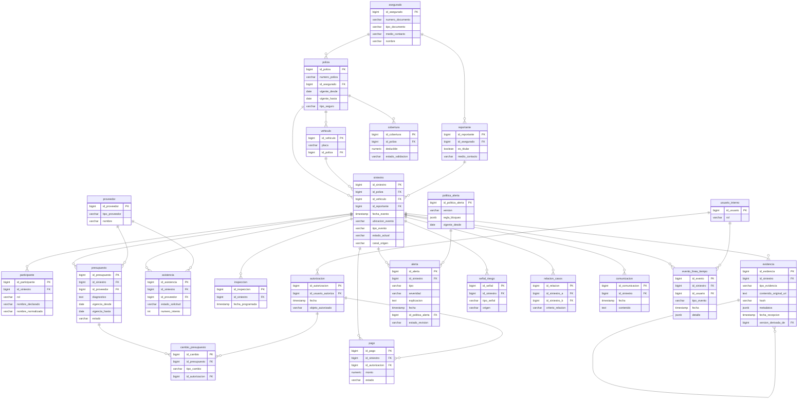

# Modelo Físico de Datos — Siniestro Fácil

> Traducción del modelo lógico a estructuras de tabla con tipos de dato concretos (sintaxis tipo PostgreSQL, a título ilustrativo). Las decisiones puramente técnicas no mencionadas en las entrevistas (motor de base de datos definitivo, particionamiento, almacenamiento de binarios en object storage vs. base de datos) **no se fijan aquí** y se listan como pendientes en `discrepancias.md`. El contenido original de evidencia (`contenido_original`) se referencia mediante URI/puntero, dado que las entrevistas exigen conservar el original pero no especifican el mecanismo de almacenamiento binario.

```sql
-- Núcleo de póliza y asegurado

CREATE TABLE asegurado (
    id_asegurado        BIGSERIAL PRIMARY KEY,
    numero_documento    VARCHAR(50) NOT NULL,
    tipo_documento      VARCHAR(30),              -- [pendiente: catálogo no definido en entrevistas]
    medio_contacto      VARCHAR(120) NOT NULL,     -- Entrevista 2, P2
    nombre              VARCHAR(200)               -- [pendiente]
);

CREATE TABLE reportante (
    id_reportante       BIGSERIAL PRIMARY KEY,
    id_asegurado        BIGINT REFERENCES asegurado(id_asegurado), -- nulo si es tercero autorizado
    es_titular          BOOLEAN NOT NULL,          -- Entrevista 1, P6
    medio_contacto      VARCHAR(120) NOT NULL      -- Entrevista 2, P2
);

CREATE TABLE poliza (
    id_poliza           BIGSERIAL PRIMARY KEY,
    numero_poliza       VARCHAR(50) NOT NULL UNIQUE,  -- Entrevista 2, P2
    id_asegurado        BIGINT NOT NULL REFERENCES asegurado(id_asegurado),
    vigente_desde        DATE NOT NULL,             -- Entrevista 1, P5
    vigente_hasta         DATE NOT NULL,             -- Entrevista 1, P5
    tipo_seguro          VARCHAR(30) NOT NULL DEFAULT 'vehicular' -- Entrevista 1, P5
);

CREATE TABLE vehiculo (
    id_vehiculo         BIGSERIAL PRIMARY KEY,
    placa               VARCHAR(15) NOT NULL,       -- Entrevista 2, P2
    id_poliza           BIGINT NOT NULL REFERENCES poliza(id_poliza)
);

CREATE TABLE cobertura (
    id_cobertura        BIGSERIAL PRIMARY KEY,
    id_poliza           BIGINT NOT NULL REFERENCES poliza(id_poliza),
    deducible           NUMERIC(12,2),              -- Entrevista 2, P1
    estado_validacion   VARCHAR(30)                 -- Entrevista 2, P1
);

-- Núcleo de siniestro

CREATE TABLE siniestro (
    id_siniestro        BIGSERIAL PRIMARY KEY,
    id_poliza           BIGINT NOT NULL REFERENCES poliza(id_poliza),
    id_vehiculo         BIGINT NOT NULL REFERENCES vehiculo(id_vehiculo),
    id_reportante        BIGINT NOT NULL REFERENCES reportante(id_reportante),
    fecha_evento         TIMESTAMP NOT NULL,         -- Entrevista 2, P1
    ubicacion_evento      VARCHAR(255) NOT NULL,      -- Entrevista 2, P1/P2
    tipo_evento           VARCHAR(50) NOT NULL,       -- Entrevista 2, P2
    descripcion           TEXT,                       -- Entrevista 2, P1
    danos_aparentes       TEXT,                       -- Entrevista 2, P1
    estado_actual         VARCHAR(30) NOT NULL,       -- Entrevista 2, P4 (ver CHECK más abajo)
    canal_origen          VARCHAR(30),                -- Entrevista 2, P6
    creado_en             TIMESTAMP NOT NULL DEFAULT now(),  -- [estructural]
    CONSTRAINT chk_estado_siniestro CHECK (estado_actual IN (
        'reportado','validando_cobertura','asistencia_coordinada','evidencia_pendiente',
        'en_evaluacion','inspeccion_programada','presupuesto_recibido','autorizado',
        'observado','rechazado','en_reparacion','listo_para_entrega','indemnizado','cerrado'
    ))
);

CREATE TABLE participante (
    id_participante      BIGSERIAL PRIMARY KEY,
    id_siniestro         BIGINT NOT NULL REFERENCES siniestro(id_siniestro),
    rol                  VARCHAR(30) NOT NULL,        -- Entrevista 2, P3
    nombre_declarado     VARCHAR(200),                -- Entrevista 3, P9
    nombre_normalizado   VARCHAR(200)                 -- Entrevista 3, P9
);

CREATE TABLE evidencia (
    id_evidencia          BIGSERIAL PRIMARY KEY,
    id_siniestro          BIGINT NOT NULL REFERENCES siniestro(id_siniestro),
    tipo_evidencia         VARCHAR(50) NOT NULL,       -- Entrevista 2, P3
    contenido_original_uri  TEXT NOT NULL,              -- Entrevista 3, P3 [mecanismo de almacenamiento: pendiente]
    hash                    VARCHAR(128) NOT NULL,      -- Entrevista 3, P3
    metadatos                JSONB,                     -- Entrevista 3, P3
    fecha_captura             TIMESTAMP,                 -- Entrevista 2, P3
    fecha_recepcion           TIMESTAMP NOT NULL,        -- Entrevista 3, P3
    fuente                    VARCHAR(50),               -- Entrevista 3, P3
    ubicacion_captura         VARCHAR(255),              -- Entrevista 2, P3
    dispositivo_captura       VARCHAR(120),              -- Entrevista 2, P3
    version_derivada_de       BIGINT REFERENCES evidencia(id_evidencia) -- Entrevista 3, P3
);

-- Asistencia, inspección y proveedores

CREATE TABLE proveedor (
    id_proveedor         BIGSERIAL PRIMARY KEY,
    tipo_proveedor        VARCHAR(30) NOT NULL,       -- Entrevista 2, P7/P9
    nombre                VARCHAR(200)                -- [pendiente]
);

CREATE TABLE asistencia (
    id_asistencia         BIGSERIAL PRIMARY KEY,
    id_siniestro          BIGINT NOT NULL REFERENCES siniestro(id_siniestro),
    id_proveedor          BIGINT REFERENCES proveedor(id_proveedor),
    estado_solicitud       VARCHAR(20) NOT NULL,       -- Entrevista 2, P9
    numero_intento          INT NOT NULL DEFAULT 1,     -- Entrevista 2, P9
    CONSTRAINT chk_estado_solicitud CHECK (estado_solicitud IN ('aceptada','rechazada','sin_respuesta'))
);

CREATE TABLE inspeccion (
    id_inspeccion         BIGSERIAL PRIMARY KEY,
    id_siniestro          BIGINT NOT NULL REFERENCES siniestro(id_siniestro),
    fecha_programada        TIMESTAMP NOT NULL          -- Entrevista 2, P8
);

-- Presupuesto y aprobaciones

CREATE TABLE presupuesto (
    id_presupuesto        BIGSERIAL PRIMARY KEY,
    id_siniestro          BIGINT NOT NULL REFERENCES siniestro(id_siniestro),
    id_proveedor          BIGINT NOT NULL REFERENCES proveedor(id_proveedor),
    diagnostico            TEXT,                       -- Entrevista 2, P7
    vigencia_desde          DATE NOT NULL,              -- Entrevista 2, P7
    vigencia_hasta          DATE NOT NULL,              -- Entrevista 2, P7
    estado                  VARCHAR(20) NOT NULL,       -- Entrevista 2, P4
    CONSTRAINT chk_estado_presupuesto CHECK (estado IN ('recibido','observado','autorizado','rechazado'))
);

CREATE TABLE usuario_interno (
    id_usuario            BIGSERIAL PRIMARY KEY,
    rol                    VARCHAR(30) NOT NULL,       -- Entrevistas 2 y 3
    CONSTRAINT chk_rol_usuario CHECK (rol IN ('operador','ajustador','investigador_fraude','supervisor'))
);

CREATE TABLE autorizacion (
    id_autorizacion       BIGSERIAL PRIMARY KEY,
    id_usuario_autoriza    BIGINT NOT NULL REFERENCES usuario_interno(id_usuario), -- Entrevista 2, P6
    fecha                   TIMESTAMP NOT NULL,          -- Entrevista 2, P6
    objeto_autorizado        VARCHAR(50) NOT NULL         -- Entrevista 2, P6/P10
);

CREATE TABLE cambio_presupuesto (
    id_cambio             BIGSERIAL PRIMARY KEY,
    id_presupuesto        BIGINT NOT NULL REFERENCES presupuesto(id_presupuesto),
    tipo_cambio             VARCHAR(30) NOT NULL,       -- Entrevista 2, P7
    id_autorizacion         BIGINT REFERENCES autorizacion(id_autorizacion),
    CONSTRAINT chk_tipo_cambio CHECK (tipo_cambio IN ('observacion','repuesto_alternativo','ampliacion'))
);

-- Antifraude

CREATE TABLE politica_alerta (
    id_politica_alerta    BIGSERIAL PRIMARY KEY,
    version                 VARCHAR(20) NOT NULL,       -- Entrevista 3, P5/P10
    regla_bloqueo            JSONB NOT NULL,             -- Entrevista 3, P5
    vigente_desde             DATE NOT NULL               -- Entrevista 3, P5
);

CREATE TABLE alerta (
    id_alerta              BIGSERIAL PRIMARY KEY,
    id_siniestro           BIGINT NOT NULL REFERENCES siniestro(id_siniestro),
    tipo                     VARCHAR(50) NOT NULL,       -- Entrevista 3, P4
    severidad                 VARCHAR(20) NOT NULL,      -- Entrevista 3, P4
    explicacion                TEXT NOT NULL,             -- Entrevista 3, P4
    datos_origen                JSONB,                     -- Entrevista 3, P4
    fecha                       TIMESTAMP NOT NULL,        -- Entrevista 3, P4
    modelo_o_regla               VARCHAR(100) NOT NULL,    -- Entrevista 3, P4
    id_politica_alerta            BIGINT NOT NULL REFERENCES politica_alerta(id_politica_alerta),
    estado_revision                VARCHAR(20) NOT NULL DEFAULT 'pendiente', -- Entrevista 3, P4
    justificacion_revision          TEXT,                  -- Entrevista 3, P4
    CONSTRAINT chk_estado_revision CHECK (estado_revision IN ('pendiente','confirmada','descartada','en_solicitud_info'))
);

CREATE TABLE señal_riesgo (
    id_señal               BIGSERIAL PRIMARY KEY,
    id_siniestro            BIGINT NOT NULL REFERENCES siniestro(id_siniestro),
    tipo_señal                VARCHAR(50) NOT NULL,      -- Entrevista 3, P2
    origen                      VARCHAR(20) NOT NULL,     -- Entrevista 3, P2
    CONSTRAINT chk_origen_señal CHECK (origen IN ('deterministica','modelo'))
);

CREATE TABLE relacion_casos (
    id_relacion             BIGSERIAL PRIMARY KEY,
    id_siniestro_a           BIGINT NOT NULL REFERENCES siniestro(id_siniestro),
    id_siniestro_b           BIGINT NOT NULL REFERENCES siniestro(id_siniestro),
    criterio_relacion          VARCHAR(30) NOT NULL,      -- Entrevista 3, P8
    CONSTRAINT chk_criterio_relacion CHECK (criterio_relacion IN ('accidente','telefono','cuenta_bancaria','taller','persona')),
    CONSTRAINT chk_no_autorrelacion CHECK (id_siniestro_a <> id_siniestro_b)
);

-- Pagos, comunicación y auditoría

CREATE TABLE pago (
    id_pago                  BIGSERIAL PRIMARY KEY,
    id_siniestro             BIGINT NOT NULL REFERENCES siniestro(id_siniestro),
    id_autorizacion            BIGINT REFERENCES autorizacion(id_autorizacion),
    monto                       NUMERIC(14,2) NOT NULL,   -- Entrevista 3, P2 (implícito)
    estado                       VARCHAR(20) NOT NULL,     -- Entrevista 3, P5
    CONSTRAINT chk_estado_pago CHECK (estado IN ('bloqueado','emitido'))
);

CREATE TABLE comunicacion (
    id_comunicacion            BIGSERIAL PRIMARY KEY,
    id_siniestro                BIGINT NOT NULL REFERENCES siniestro(id_siniestro),
    fecha                         TIMESTAMP NOT NULL,      -- Entrevista 2, P10
    contenido                      TEXT                     -- Entrevista 2, P10
);

CREATE TABLE evento_linea_tiempo (
    id_evento                  BIGSERIAL PRIMARY KEY,
    id_siniestro                 BIGINT NOT NULL REFERENCES siniestro(id_siniestro),
    id_usuario                     BIGINT REFERENCES usuario_interno(id_usuario), -- Entrevista 2, P10
    tipo_evento                     VARCHAR(50) NOT NULL,   -- Entrevista 2, P10
    fecha                             TIMESTAMP NOT NULL DEFAULT now(), -- Entrevista 2, P10
    detalle                            JSONB                 -- Entrevista 2, P10
);

-- Índices sugeridos por consultas descritas en las entrevistas
CREATE INDEX idx_siniestro_estado ON siniestro(estado_actual);           -- Entrevista 1, P3 (vista única/seguimiento)
CREATE INDEX idx_evidencia_hash ON evidencia(hash);                      -- Entrevista 3, P2/P6 (fotos reutilizadas)
CREATE INDEX idx_relacion_casos_a ON relacion_casos(id_siniestro_a);     -- Entrevista 3, P8
CREATE INDEX idx_relacion_casos_b ON relacion_casos(id_siniestro_b);     -- Entrevista 3, P8
CREATE INDEX idx_evento_timeline_siniestro ON evento_linea_tiempo(id_siniestro, fecha); -- Entrevista 2, P10
```

## Decisiones físicas explícitamente pendientes
- Motor de base de datos definitivo y estrategia de almacenamiento de archivos binarios de evidencia (base de datos vs. almacenamiento de objetos). *(No especificado en las entrevistas — ver discrepancias.md)*
- Particionamiento o archivado histórico dado el volumen operativo mencionado (~420,000 pólizas activas, ~18,000 siniestros/mes). *(Contexto ficticio del documento, sin definición de retención — ver discrepancias.md)*
- Catálogo cerrado de `tipo_documento`, `canal_origen` y `tipo_evento`: las entrevistas mencionan ejemplos (teléfono, correo, aplicación móvil, corredor) pero no un catálogo exhaustivo y cerrado.

## Diagrama entidad-relación físico (mermaid)


