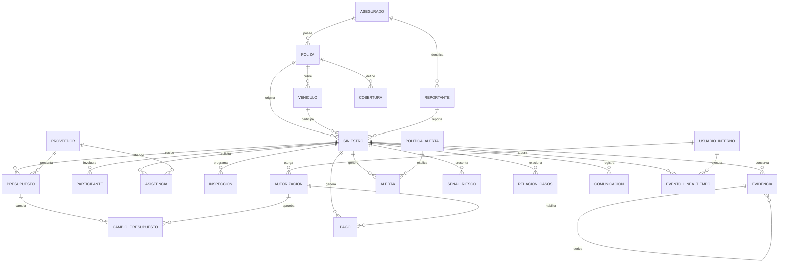

# Modelo físico validado — Siniestro Fácil (PostgreSQL)

## Resultado de la validación

El modelo lógico de `07_modelo_logico.md` contiene 21 entidades y todas se materializan en PostgreSQL. El DDL ejecutable está en [`postgresql/01_schema.sql`](postgresql/01_schema.sql) y las pruebas de integridad en [`postgresql/02_test_constraints.sql`](postgresql/02_test_constraints.sql).

Se conserva la semántica del modelo lógico con una única normalización de nombres: `SEÑAL_RIESGO.id_señal/tipo_señal` se implementa como `senal_riesgo.id_senal/tipo_senal` para mantener identificadores SQL portables sin necesidad de comillas.

## Decisiones físicas

| Aspecto | Implementación | Motivo |
|---|---|---|
| Identificadores | `bigint GENERATED ALWAYS AS IDENTITY` | Estándar PostgreSQL y crecimiento suficiente |
| Fechas de negocio | `date` | Vigencias sin componente horario |
| Eventos | `timestamptz` | Evita ambigüedad de zona horaria |
| Importes | `numeric(p,2)` | Precisión decimal determinística |
| Datos explicables | `jsonb` | Conserva entradas de reglas, metadatos y detalle auditable |
| Evidencia | URI + hash + metadatos | Separa el binario del modelo transaccional y preserva trazabilidad |
| Dominios cerrados | `CHECK` con nombre | Errores legibles y pruebas directas |
| Borrado | `CASCADE` sólo para agregados dependientes; `RESTRICT` para maestros y autorizaciones | Evita huérfanos sin borrar referencias de negocio sensibles |

## Constraints añadidos durante la validación

- Coherencia temporal: vigencias de póliza/presupuesto, captura/recepción de evidencia y fecha del evento.
- Coherencia de pertenencia: la FK compuesta de `siniestro(id_vehiculo,id_poliza)` impide asociar un vehículo a una póliza distinta.
- Integridad económica: deducible no negativo, pago estrictamente positivo y autorización obligatoria para pagos emitidos.
- Integridad del flujo: catálogos de estados, roles, señales, proveedores, solicitudes y cambios.
- Evidencia inmutable: un trigger impide cambiar el siniestro, URI, hash, recepción o fuente del original.
- Relaciones entre casos: orden canónico `id_siniestro_a < id_siniestro_b` y unicidad por criterio, eliminando autorrelaciones y duplicados invertidos.
- Calidad mínima: campos identificadores de negocio y contenidos obligatorios no aceptan cadenas vacías.

## Trazabilidad lógico–física

| Bloque lógico | Tablas físicas |
|---|---|
| Póliza y asegurado | `asegurado`, `reportante`, `poliza`, `vehiculo`, `cobertura` |
| Siniestro | `siniestro`, `participante`, `evidencia` |
| Operación | `proveedor`, `asistencia`, `inspeccion`, `presupuesto`, `cambio_presupuesto` |
| Autorización | `usuario_interno`, `autorizacion`, `pago` |
| Antifraude | `politica_alerta`, `alerta`, `senal_riesgo`, `relacion_casos` |
| Auditoría y contacto | `comunicacion`, `evento_linea_tiempo` |

## Diagrama físico resumido

## Ejecución

Consulte [`postgresql/README.md`](postgresql/README.md). Las pruebas se ejecutan dentro de una transacción con `ROLLBACK`, verifican el `SQLSTATE` exacto y no dejan datos residuales.

## Pendientes no inventados

El modelo lógico no define catálogos exhaustivos para `tipo_documento`, `canal_origen`, `tipo_evento`, `rol` de participante ni `tipo_evidencia`; por tanto permanecen como texto validado sólo contra vacío. Tampoco define moneda, ciudad/zona horaria operativa, retención ni proveedor de almacenamiento de objetos. Estas decisiones deben resolverse antes de producción sin alterar la cardinalidad validada aquí.
