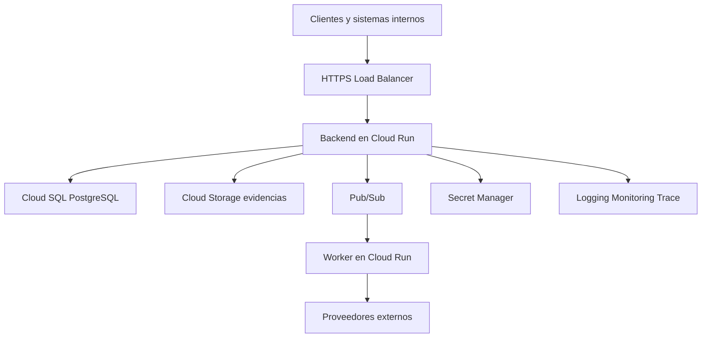

# Arquitectura de despliegue en Google Cloud

## Decisión

Todos los componentes propios de Siniestro Fácil se desarrollan, despliegan y operan en Google Cloud. Los proveedores de negocio externos se consumen mediante adaptadores ejecutados desde GCP.

## Proyecto conocido

| Elemento | Valor |
|---|---|
| Nombre visible | My First Project |
| Project ID | `project-77c17016-86bc-4fc4-a97` |
| Región Cloud SQL | `us-central1` |
| Instancia | `dmcappasistidaia` |
| Base | `DMCSINIESTROFACIL` |
| Esquema | `siniestro_facil` |

## Topología del piloto

## Ambientes

- Propuesta: proyectos GCP separados para desarrollo, pruebas y producción.
- Mientras sólo exista el proyecto actual, no se desplegará producción mezclada con desarrollo sin aprobación explícita.
- Cada ambiente tendrá cuentas de servicio, secretos, buckets, tópicos y bases separados.
- Los nombres definitivos de proyectos y regiones están `POR CONFIRMAR`.

## Red y acceso a datos

- Cloud Run se conecta a Cloud SQL mediante el conector administrado y una cuenta de servicio con privilegios mínimos.
- Se recomienda IP privada para Cloud SQL; la topología VPC final depende de la configuración existente.
- El backend no utiliza el usuario `postgres` en operación normal.
- Las migraciones usan una identidad separada del runtime.

## Evidencias

- El backend genera una autorización temporal de carga a Cloud Storage.
- Al finalizar la carga registra URI, hash y metadatos en PostgreSQL.
- El bucket activa versionado, cifrado administrado y política de retención.
- La ubicación, clase, duración y uso de claves administradas por cliente están `POR CONFIRMAR`.

## Procesamiento asíncrono

- Pub/Sub transporta solicitudes de asistencia, notificaciones y trabajos de análisis.
- Cloud Tasks gestiona llamadas con horario, timeout y reintento dirigido.
- Los consumidores son idempotentes y utilizan dead-letter topics para fallos permanentes.

## Seguridad

- IAM de privilegio mínimo y una cuenta de servicio por componente.
- Secret Manager para credenciales externas.
- Artifact Registry con análisis de vulnerabilidades.
- Cloud Audit Logs para acciones administrativas.
- Cloud Armor cuando el API sea público.

## Entrega

- Cloud Build ejecuta validaciones y crea la imagen.
- Artifact Registry conserva imágenes inmutables.
- Cloud Deploy o revisiones de Cloud Run promueven versiones entre ambientes.
- Terraform u otra infraestructura como código queda `POR CONFIRMAR`; no se crearán recursos manuales sin registrar su configuración.
