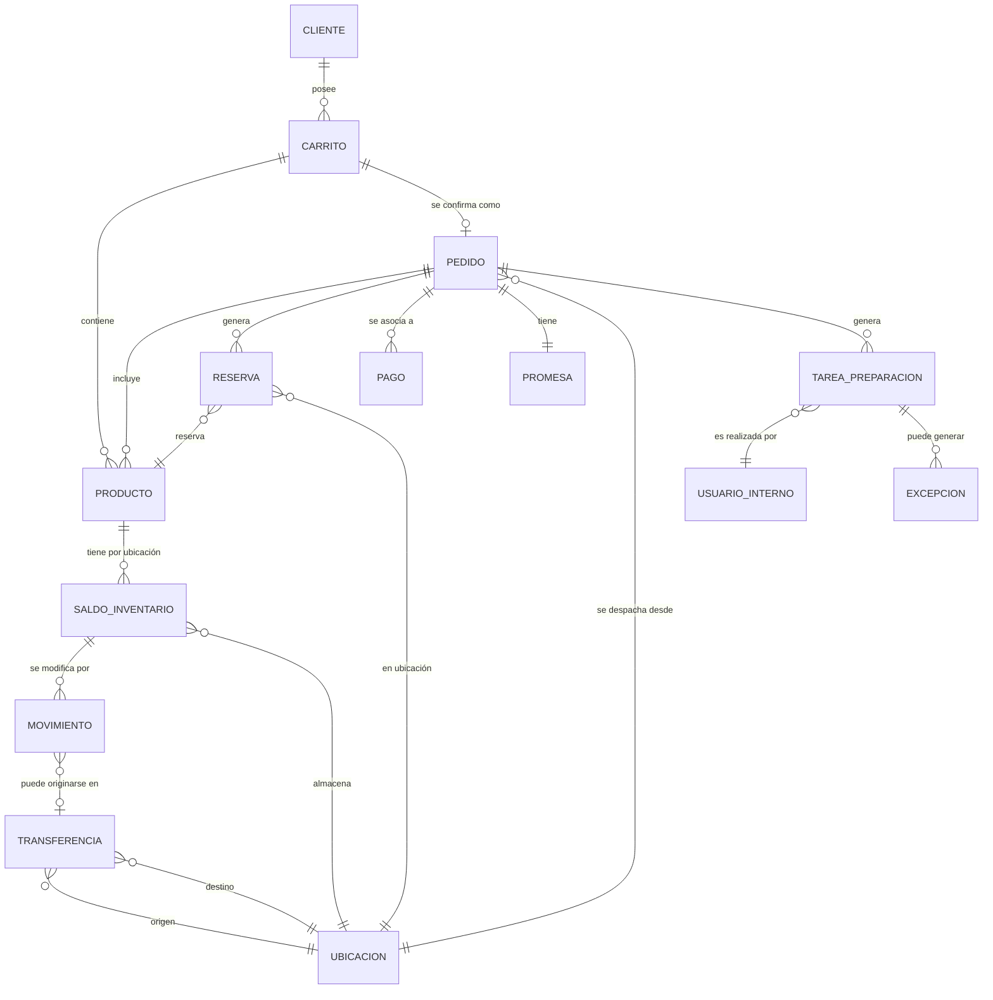
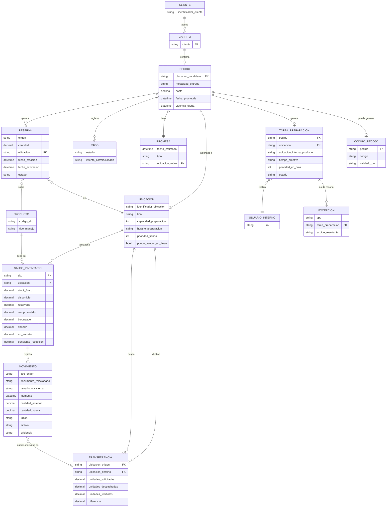
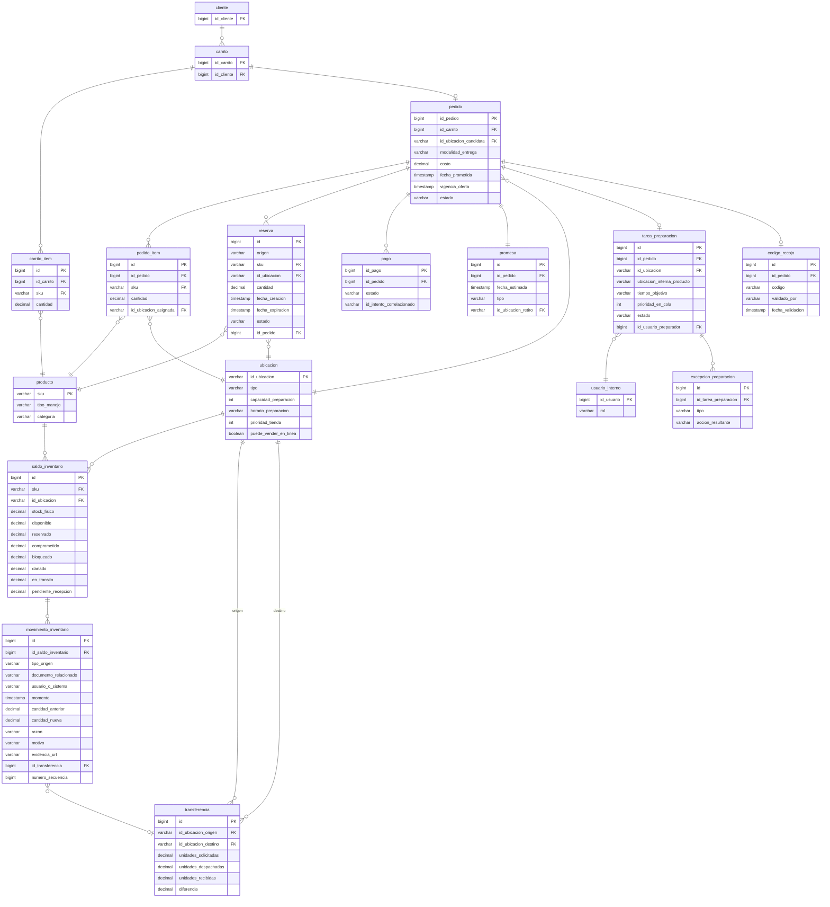
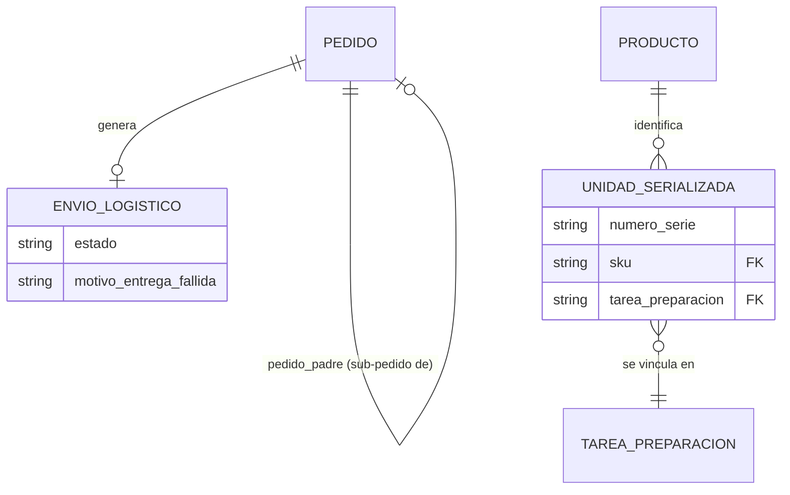

# Modelos de Datos — Stock Único (NovaRetail)

> Los **nombres de entidades, atributos y relaciones** provienen de las entrevistas (objetos de negocio de la tabla de evidencias y detalles dados por Supply Chain y E-commerce). Los **tipos de dato físicos** (VARCHAR, DECIMAL, longitudes, etc.) son **supuestos técnicos del arquitecto**, no reglas de negocio — se marcan explícitamente como tal y se listan en `07_discrepancias.md`, porque ningún entrevistado definió formatos o longitudes.

---

## 1. Modelo Conceptual

### Entidades identificadas (trazabilidad)
| Entidad | Fuente |
|---|---|
| Producto | EV (objetos de negocio: Producto, SKU) |
| Ubicación | EV; SC-7, SC-8 |
| SaldoInventario | SC-1 |
| Movimiento | SC-2, SC-10 |
| Reserva | SC-4, EC-2 |
| Carrito | EV; EC-3 |
| Pedido | EV; EC-3, EC-4 |
| Pago | EV; EC-8 |
| Promesa | EV; CEO-6, EC-3 |
| TareaPreparación | EV; EC-4, EC-7 |
| Transferencia | SC-8 |
| Cliente | EV (actor); CEO-6 |
| Usuario interno (cajero, preparador, supervisor, operador logístico) | EV (actores) |
| Excepción (faltante/daño) | EC-5, EC-7 |

### Relaciones (nivel conceptual)
- Cliente **posee** Carrito
- Carrito **contiene** Producto (mediante ítems)
- Carrito **se convierte en** Pedido
- Pedido **incluye** Producto (mediante ítems del pedido)
- Pedido **se asocia a** Reserva
- Pedido **se asocia a** Pago
- Pedido **tiene** Promesa
- Pedido **se asigna a** Ubicación
- Pedido **genera** TareaPreparación
- TareaPreparación **la realiza** Usuario interno (preparador)
- TareaPreparación **puede generar** Excepción
- Producto **tiene** SaldoInventario por Ubicación
- SaldoInventario **se modifica por** Movimiento
- Movimiento **puede originarse en** Transferencia
- Transferencia **conecta** dos Ubicaciones (origen/destino)
- Reserva **afecta** SaldoInventario

### Diagrama Entidad-Relación (Mermaid) — Conceptual

---

## 2. Modelo Lógico

> Se detallan atributos mencionados explícitamente en las entrevistas. No se agregan atributos ausentes del input; donde existe un atributo evidentemente necesario pero no declarado (por ejemplo, un identificador técnico), se marca `[supuesto técnico]`.

### Entidades y atributos

**Producto**
- codigo_sku *(EV, SC-1)*
- tipo_manejo: serializado | lote *(SC-1)*
- categoria *[supuesto técnico — mencionado indirectamente en CEO-5 como "tecnología y pequeños electrodomésticos" sin modelo formal de categoría]*
- requiere_numero_serie *(Cierre de Brechas D-08 — true para categorías del MVP)*

**UnidadSerializada** *(nueva entidad, Cierre de Brechas D-08)*
- numero_serie
- sku (ref. Producto)
- tarea_preparacion (ref. TareaPreparacion, se vincula solo en el momento de preparación, no al crear la reserva)

**Ubicacion**
- identificador_ubicacion *[supuesto técnico]*
- tipo: tienda | centro_distribucion *(EV: "78 tiendas... dos centros de distribución")*
- capacidad_preparacion *(SC-7)*
- horario_preparacion *(SC-7)*
- prioridad_tienda *(SC-7)*
- puede_vender_en_linea *(SC-7)*
- puede_preparar_en_horario_actual *(SC-7)*

**SaldoInventario**
- sku (ref. Producto)
- ubicacion (ref. Ubicacion)
- stock_fisico *(SC-1)*
- disponible *(SC-1)*
- reservado *(SC-1)*
- comprometido *(SC-1)*
- bloqueado *(SC-1)*
- dañado *(SC-1)*
- en_transito *(SC-1)*
- pendiente_recepcion *(SC-1)*
- stock_seguridad_parametro *(Cierre de Brechas D-01 — porcentaje configurable por SKU/ubicación, 5% tienda / 2% centro de distribución por defecto)*

**Movimiento**
- tipo_origen: venta_caja | pedido_web | recepcion_proveedor | transferencia | devolucion | anulacion | conteo | ajuste | daño | robo | cambio_estado *(SC-2)*
- documento_relacionado *(SC-10)*
- usuario_o_sistema *(SC-10)*
- momento *(SC-10)*
- cantidad_anterior *(SC-10)*
- cantidad_nueva *(SC-10)*
- razon *(SC-6, SC-10)*
- motivo *(SC-6)*
- evidencia *(SC-6)*
- secuencia_evento *[supuesto técnico, necesario para detectar "eventos fuera de orden" (SC-10) pero sin campo explícito declarado]*

**Reserva**
- origen *(SC-4)*
- cantidad *(SC-4)*
- ubicacion (ref. Ubicacion) *(SC-4)*
- fecha_creacion *(SC-4)*
- fecha_expiracion *(SC-4)*
- estado: creada | confirmada | liberada | vencida | trasladada *(SC-4)*
- extension_aplicada *(Cierre de Brechas D-02 — booleano, indica si ya se usó la extensión única de 5 minutos por pago "procesando")*

**Transferencia**
- ubicacion_origen *(SC-8)*
- ubicacion_destino *(SC-8)*
- unidades_solicitadas *(SC-8)*
- unidades_despachadas *(SC-8)*
- unidades_recibidas *(SC-8)*
- diferencia *(SC-8)*

**Carrito**
- cliente (ref. Cliente) *(EV)*
- items (producto + cantidad) *(EC-3)*

**Pedido**
- ubicacion_candidata *(EC-3)*
- modalidad_entrega *(EC-3)*
- costo *(EC-3)*
- fecha_prometida *(EC-3)*
- vigencia_oferta *(EC-3)*
- estado *[supuesto técnico — se infiere de EC-4/EC-5/EC-6 la existencia de estados de pedido, pero no se declara una lista cerrada de estados como sí ocurrió en el caso de Reserva]*
- pedido_padre *(Cierre de Brechas D-09 — referencia opcional al pedido original cuando este es un sub-pedido generado por partición de carrito)*

**EnvioLogistico** *(nueva entidad, Cierre de Brechas D-10)*
- pedido (ref. Pedido)
- estado: recibido_por_logistica | en_transito | entregado | entrega_fallida
- motivo_entrega_fallida (si aplica)

**Promesa**
- fecha_estimada *(CEO-6)*
- tipo: domicilio_hoy | domicilio_manana | retiro_tienda *(CEO-6)*
- ubicacion_retiro (ref. Ubicacion, si aplica) *(CEO-6)*

**Pago**
- estado: aprobado *(EC-8)* *[solo se menciona explícitamente el estado "aprobado"; otros estados no fueron declarados]*
- intento_correlacionado *(EC-8)*

**TareaPreparacion**
- pedido (ref. Pedido)
- ubicacion (ref. Ubicacion)
- ubicacion_interna_producto *(EC-7)*
- tiempo_objetivo *(EC-7)*
- prioridad_en_cola *(EC-7)*
- estado: pendiente | en_preparacion | lista *[supuesto técnico basado en EC-4]*

**Excepcion**
- tipo: faltante | dañado *(EC-5, EC-7)*
- tarea_preparacion (ref. TareaPreparacion)
- accion_resultante: nueva_ubicacion | recalculo_promesa *(EC-5)*

**CodigoRecojo**
- pedido (ref. Pedido) *(EC-6)*
- codigo *(EC-6)*
- validado_por *(EC-6)*

**UsuarioInterno**
- rol: cajero | preparador | supervisor | operador_logistico *(EV)*

### Diagrama Entidad-Relación (Mermaid) — Lógico

---

## 3. Modelo Físico

> **Advertencia de trazabilidad:** los tipos de dato (VARCHAR(n), DECIMAL(p,s), TIMESTAMP, etc.), las claves primarias/foráneas técnicas y la normalización en tablas son **decisiones de diseño del arquitecto de soluciones**, no reglas de negocio provistas por las entrevistas. Se documentan aquí como propuesta técnica, sujeta a validación, y se listan también en `07_discrepancias.md`.

### Tablas propuestas (nombres técnicos snake_case)

- `producto` (sku PK, tipo_manejo, categoria)
- `ubicacion` (id_ubicacion PK, tipo, capacidad_preparacion, horario_preparacion, prioridad_tienda, puede_vender_en_linea)
- `saldo_inventario` (id PK, sku FK, id_ubicacion FK, stock_fisico, disponible, reservado, comprometido, bloqueado, danado, en_transito, pendiente_recepcion)
- `movimiento_inventario` (id PK, id_saldo_inventario FK, tipo_origen, documento_relacionado, usuario_o_sistema, momento, cantidad_anterior, cantidad_nueva, razon, motivo, evidencia_url, id_transferencia FK nullable, numero_secuencia)
- `reserva` (id PK, origen, sku FK, id_ubicacion FK, cantidad, fecha_creacion, fecha_expiracion, estado, id_pedido FK)
- `transferencia` (id PK, id_ubicacion_origen FK, id_ubicacion_destino FK, unidades_solicitadas, unidades_despachadas, unidades_recibidas, diferencia)
- `cliente` (id_cliente PK)
- `carrito` (id_carrito PK, id_cliente FK)
- `carrito_item` (id PK, id_carrito FK, sku FK, cantidad)
- `pedido` (id_pedido PK, id_carrito FK, id_ubicacion_candidata FK, modalidad_entrega, costo, fecha_prometida, vigencia_oferta, estado)
- `pedido_item` (id PK, id_pedido FK, sku FK, cantidad, id_ubicacion_asignada FK)
- `promesa` (id PK, id_pedido FK, fecha_estimada, tipo, id_ubicacion_retiro FK nullable)
- `pago` (id_pago PK, id_pedido FK, estado, id_intento_correlacionado)
- `tarea_preparacion` (id PK, id_pedido FK, id_ubicacion FK, ubicacion_interna_producto, tiempo_objetivo, prioridad_en_cola, estado, id_usuario_preparador FK)
- `excepcion_preparacion` (id PK, id_tarea_preparacion FK, tipo, accion_resultante)
- `codigo_recojo` (id PK, id_pedido FK, codigo, validado_por, fecha_validacion)
- `usuario_interno` (id_usuario PK, rol)

### Diagrama Entidad-Relación (Mermaid) — Físico

## 4. Delta de modelo derivado del Cierre de Brechas

> Los diagramas Mermaid de las secciones 1 a 3 corresponden a la versión previa al cierre de brechas. Los siguientes cambios fueron incorporados a nivel de atributos/entidades en el modelo lógico (ver arriba) y deben reflejarse en la próxima actualización de los diagramas y del modelo físico:

- **SaldoInventario** gana `stock_seguridad_parametro` (D-01).
- **Reserva** gana `extension_aplicada` (D-02).
- **Producto** gana `requiere_numero_serie`; se agrega la entidad **UnidadSerializada** relacionada 1..1 con TareaPreparacion (D-08).
- **Pedido** gana `pedido_padre` (referencia a sí mismo) para modelar sub-pedidos por partición de carrito (D-09).
- Se agrega la entidad **EnvioLogistico**, relacionada 1..1 con Pedido, para registrar los eventos del operador logístico tras el despacho (D-10).

## Nota de autovalidación
Todos los nombres de entidad, atributo y relación en los tres niveles provienen de las entrevistas o de la tabla de evidencias, salvo los elementos marcados `[supuesto técnico]` y los del apartado 4, que provienen de `08_cierre_de_brechas.md` y están citados como tal. Los tipos de dato del modelo físico completo siguen siendo decisiones de diseño del arquitecto, listadas en `07_discrepancias.md`.
